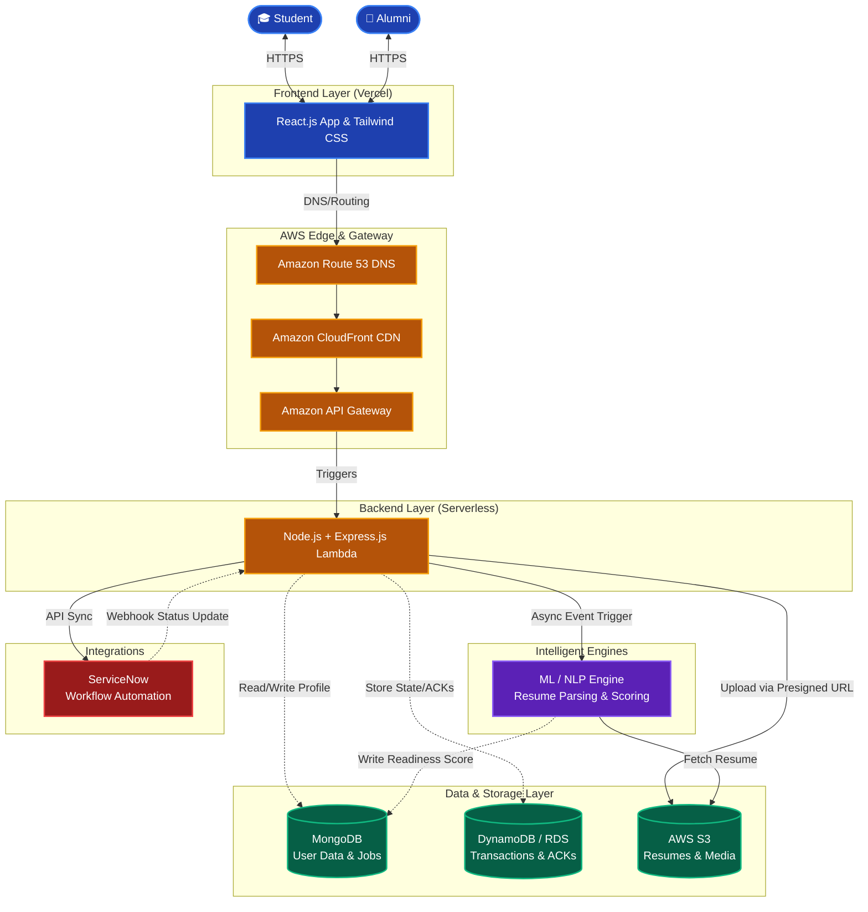

# Smart Alumni Connect & Job Referral System

 

  

> *A next-generation, AI-powered platform designed to seamlessly connect students with alumni for mentorship and job referrals. The system evaluates student readiness using NLP-based resume parsing and streamlines referral processes using ServiceNow workflows.*

  

## System Architecture Overview
The platform adopts a modern, decoupled **serverless architecture** to ensure maximum scalability, cost-efficiency, and low latency.

 

### 1. Frontend Layer
 

| Feature | Description |
| :--- | :--- |
| **Framework** | React.js for dynamic UI rendering. |
| **Styling** | Tailwind CSS for a highly responsive, utility-first design system. |
| **Hosting & CI/CD** | Deployed via **Vercel** to leverage its global edge CDN. |
| **Interfaces** | **Student Portal** (Dashboard, Upload, Jobs, Mentorship, Readiness Score, Notifications)   **Alumni Portal** (Dashboard, Requests, ACKs, Post Jobs, Notifications) |

 

### 2. Backend Layer
 

| Feature | Description |
| :--- | :--- |
| **Framework** | Node.js paired with Express.js for robust routing and middleware support. |
| **Compute** | Fully serverless execution on **AWS Lambda**. |
| **Gateway** | **Amazon API Gateway** to route HTTP requests, manage rate limits, and provide a secure edge. |

 

### 3. Database & Storage Layer (Polyglot Persistence)
 

| Service | Purpose |
| :--- | :--- |
| **MongoDB Atlas** | Serves as the primary Document DB for flexible storage (User Profiles, Unstructured Job Listings, Mentorship Data). |
| **AWS DynamoDB / RDS** | Handles structured, fast transactional data requiring ACID compliance (Referral state tracking, Acknowledgements). |
| **Amazon S3** | Secure object storage for large static files (PDF Resumes, Profile Avatars). |

 

### 4. Core Integrations & Engines
 

| Integration | Functionality |
| :--- | :--- |
| **ServiceNow Integration** | A dedicated pipeline linking backend events to ServiceNow workflows. Handles automated job referral tracking, IT ticketing for support, and real-time status synchronization. |
| **ML / NLP Engine** | An intelligent microservice that:   • Parses uploaded PDF/DOCX resumes.   • Extracts key skills and calculates a **Placement Readiness Score**.   • Dynamically maps student profiles to Recommended Jobs from the MongoDB job board. |

  

## User Workflows (Data Flow)

 

<ol>
  <li>
    <b>Upload & Request:</b> A student logs in, uploads their resume (saved directly to AWS S3 via pre-signed URL), and requests mentorship or a job referral.
  </li>
   
  <li>
    <b>Analysis:</b> The ML Engine triggers automatically, parses the resume, calculates the Readiness Score, and updates the student's MongoDB profile. Recommended jobs are instantly suggested.
  </li>
   
  <li>
    <b>Alumni Interaction:</b> An alumnus receives the request in their portal. They can review the profile and trigger a <code>Mentorship ACK</code> or <code>Referral Acknowledged</code> action.
  </li>
   
  <li>
    <b>ServiceNow Tracking:</b> Acknowledged referrals are pushed to ServiceNow via API, creating a tracked workflow ticket that syncs status back to the user dashboards.
  </li>
</ol>

  

## DevOps & Infrastructure

 

| Category | Technology |
| :--- | :--- |
| **Version Control** | Git & GitHub |
| **CI/CD Pipelines** | Managed completely by **GitHub Actions** (Linting, Testing, and Deployments to AWS/Vercel) |
| **API Testing** | Centralized **Postman** collections for automated contract and integration testing |
| **DNS / Routing** | Managed by **AWS Route 53**, providing custom domain routing to Vercel (Frontend) and API Gateway (Backend) |

  

## API Design Considerations

 

<ul>
  <li><b>RESTful Endpoints:</b> Resource-oriented paths (<code>/api/v1/students</code>, <code>/api/v1/referrals</code>).</li>
   
  <li><b>Stateless Authentication:</b> JWT (JSON Web Tokens) validated via API Gateway Custom Authorizers.</li>
   
  <li><b>Idempotency:</b> Crucial for state-changing operations like ACKs to prevent duplicate ServiceNow tickets.</li>
   
  <li><b>Asynchronous Communication:</b> Long-running tasks (like Resume NLP Parsing) return a <code>202 Accepted</code> status while processing in the background (AWS SQS/SNS), with clients polling or utilizing WebSockets for completion status.</li>
</ul>

  

## Interactive Architecture Documentation

For a visual, animated representation of the architecture and data flows, please view the included HTML file:

   
  <b><a href="./architecture.html">Open architecture.html</a></b> in your browser or double click it in your file explorer.
    

> Note: The HTML file includes interactive Mermaid.js diagrams and a polished UI built with Tailwind CSS.

---

  <i>Designed & Architected for high performance, seamless integration, and intelligent student-alumni networking.</i>

